<div align="center">


### Two AI models harden your plan before a line of code exists — then swap jobs to build it.

[](https://github.com/ujconsulting/claudex-loop/stargazers)
[](./LICENSE)
[](https://docs.anthropic.com/en/docs/claude-code)
[](https://github.com/openai/codex)

*The plan that sounds finished usually isn't. In claudex-loop's first real run, a deeply-researched, interview-locked plan still contained **one unbuildable subsystem and six designs that would have corrupted data** — a rival model found all of them before any code existed.*

</div>

---

## Why

AI-assisted coding fails in two places: the gap between **you and Claude** (do we agree on what to build?) and the gap between **Claude and its own output** (is the plan actually correct — and how would you even know?). The model that wrote the plan can't be trusted to grade it. That's an echo chamber.

Claudex-loop closes both gaps: Claude locks intent *with you*, then **OpenAI Codex** — a rival, cross-provider model — attacks the locked plan round after round until it can't find anything else wrong.

```mermaid
flowchart LR
    A["🔍 RECON<br>codebase recon or<br>greenfield research"] --> L["📋 Assumptions Ledger<br>you confirm in one batch"]
    L --> B["🎯 INTERROGATE<br>load-bearing questions<br>one at a time"]
    B --> P["PLAN.md locked"]
    P --> C["⚔️ PLAN REVIEW<br>the adversary attacks it<br>in a read-only sandbox"]
    C -- REVISE --> R["the producer arbitrates<br>and revises"]
    R -- same session --> C
    C -- APPROVED --> S["✍️ You sign off"]
    S -. optional .-> D["🔨 BUILD<br>one model writes"]
    D --> I["🔬 CROSS-INSPECT<br>the other model<br>grades the diff"]
    I --> G["✅ You approve<br>the final diff"]
    I -. optional gate .-> V["🧪 ACCEPTANCE GATE<br>dod · quality · security<br>+ docs · tests"]
    V -. facing the network:<br>then it is required .-> X["🛡️ EXPOSURE PASS<br>own model, own effort<br>SAFE / UNSAFE"]
    V --> G
    X --> G
    classDef producer fill:#d97757,stroke:#7a3a24,color:#fff
    classDef adversary fill:#10a37f,stroke:#0a6b54,color:#fff
    classDef human fill:#e8b93e,stroke:#8a6a14,color:#1a1a1a
    classDef artifact fill:#3d3d3d,stroke:#6b6b6b,color:#fff
    class A,B,R,D producer
    class C,I,V,X adversary
    class L,S,G human
    class P artifact
```



**You enter at four points only:** confirming the ledger, answering the interview, signing off the converged plan, and approving the final diff if you build. Every reviewing step is read-only and never touches a file.

**Orange is whoever produces, green is whoever grades — not Claude and Codex.** The colours name *roles*, because in this fork the actor behind each one is configuration (see [The actor is configuration, not a name](#the-actor-is-configuration-not-a-name)). In the delegation arrangement the boxes swap models without the diagram changing.

**Dotted edges are conditional.** Building is optional; so is the acceptance gate on the finished diff — *except* when the change faces the network, where it and its exposure pass are required and `EXPOSURE: UNSAFE` blocks the commit. Solid edges always happen. `audit`, `docs-backfill` and `setup` are deliberately absent: they are not steps in this loop at all — see [Beyond the plan](#beyond-the-plan-this-fork).

## The four phases

| | What happens | What makes it different |
|---|---|---|
| **🔍 0 — RECON** | Claude scouts *before* asking you anything — explores the codebase and living docs, or on greenfield researches prior art, stacks, and known pitfalls (research depth is a gate **you** control, up to a multi-agent deep-research workflow) | Opens with an **Assumptions Ledger**: everything already resolved, batch-confirmed in one reply. The interview never wastes questions the code or research already answered |
| **🎯 1 — INTERROGATE** | A visible **decision map** splits open decisions into load-bearing (asked one at a time) and cosmetic (batched, veto-by-exception) | Every question must justify its existence: *why it matters*, a committed *recommendation*, and *what breaks if we guess wrong*. Escape hatch: "accept all remaining recommendations" |
| **⚔️ 2 — REVIEW** | Codex reviews `PLAN.md` in a read-only sandbox → `VERDICT: APPROVED` or `REVISE` with concrete flaws. Claude arbitrates (rejects bad critiques *with logged reasons*), revises, and resumes the **same Codex session** | The reviewer remembers its prior findings and attacks its own accepted fixes. Bounded by `MAX_ROUNDS` — a flagged deadlock beats a fake "approved" |
| **🔨 3 — BUILD** *(optional)* | You pick the builder. **Codex builds** (`build`, full write access) → Claude reads the entire diff like a contributor PR and runs the proof test itself. **Claude builds** → a *fresh* read-only Codex session cross-inspects the finished diff against the plan — on by default, findings arbitrated and logged | The final code is always graded by the rival model, whichever one wrote it. Skipping the inspection requires an explicit, logged opt-out |

**The invariant across all four:** *whoever made the thing never checks the thing.* Plan by Claude → attacked by Codex. Code by Codex → reviewed by Claude. Code by Claude → inspected by Codex. No one grades their own work, in any path.

Two artifacts every run: `PLAN.md` (the *what*) and `PLAN-REVIEW-LOG.md` (the full round-by-round argument — the *why*).

## Beyond the plan (this fork)

Phase 3 closes with an optional acceptance gate on the finished diff. **These four skills are not part of that loop** — they run on their own, on artefacts the loop never sees.

| Skill | Judges | Verdict |
|---|---|---|
| **`code-review`** | the finished diff against the plan, in up to five dimensions — plus, for anything that faces the network, a separate exposure pass on its own model | `DOD` · `QUALITY` · `SECURITY` · `DOCS` · `TESTS` · `EXPOSURE` |
| **`docs-backfill`** | standing documentation debt, decoupled from any diff | `DOCS: ACCURATE / INACCURATE` |
| **`audit`** | a codebase nobody ever reviewed — no diff, no plan, no baseline | `AUDIT: CLEAN / CONCERNS / CRITICAL` per slice · `EXPOSURE: SAFE / UNSAFE` per exposed component |
| **`setup`** | nothing — it *wires a repo up*: wrapper, reviewer role, check catalogue, taboo scope, trust | a live read-only Codex call that must answer |

`code-review` gained `docs` and `tests` because a gate that never asks "is this documented" and "would the tests fail if the code were wrong" leaves the two cheapest defects in place. Add them whenever the diff changes behaviour.

`audit` exists because `code-review` needs a diff and a plan, and an inherited repo has neither. It slices the repo, runs the deterministic tooling **first** so the model spends its attention where linters cannot reach, and produces a **baseline** — after which every later `code-review` only judges the delta instead of re-raising the same debt.

`docs-backfill` writes what the gates found missing. Claude writes, a fresh read-only session grades: a generator that emits docstrings and ships them has nobody checking whether they are *true*, and a confidently wrong docstring is worse than a missing one.

`setup` is the odd one out: it judges nothing, it *installs*. Per repo it wires the reviewer role, the project-specific check catalogue, the taboo scope (read-only means Codex doesn't write — everything it reads still goes to OpenAI), the trust entry, and the read-only wrapper below.

### The actor is configuration, not a name

Upstream bakes the model into the skill name (`codex-review` reviews, `codex-build` builds). That reads fine until you want the other arrangement — then the name lies. Here the skills are named after the **activity**, and who performs it comes from `.claudex.yaml`:

```yaml
roles:
  plan: claude          # Delegation:  build: codex + code-review: claude
  plan-review: codex    # Dual draft:  plan: [claude, codex] + plan-review: cross
  build: claude
  code-review: codex
  exposure-review: codex   # second grader of build — gpt-5.6-sol/medium by default, see ROLES.md
  docs: claude
  docs-review: codex
  audit: codex
```

`scripts/claudex_roles.py` resolves it and **refuses with a non-zero exit** — not a warning — when an actor would grade its own work (`producer_never_reviews`) or a reviewing role would run with an open sandbox (`write_access`). Claude is the orchestrator, so a review role assigned to `claude` is rejected unless it enters as a fresh subagent. Full reasoning in [`ROLES.md`](ROLES.md).

### One lesson worth stealing

**Hand the reviewer numbered lines.** The first real `audit` run produced sound findings at wrong addresses — citations landed on blank lines and unrelated statements, because the code went into the prompt unnumbered and the model had to *count*. Measured on the same 2,658-line slice: 5 of 23 citations on blank lines without numbering, 0 of 28 with it. A few percent more input tokens removes the entire class of error.

## Receipts

From the first end-to-end greenfield run (a solo-creator CRM):

<p align="center"></p>

- **55 findings across 5 rounds** — converging 26 → 15 → 12 → 2 → 0
- **1 fatal:** an access-path architecture that could not be built as written (read as completely plausible)
- **~6 wrong models** that would have shipped and corrupted data weeks later
- **~7 missing subsystems**, including the homepage feature that had no backing data source
- **What survived untouched:** every product decision from the interview. The review only ever attacked *how it would break* — the phases genuinely divide the labor

### And then this fork turned the tools on themselves

That run is upstream's evidence for the *plan* loop. This fork's own evidence is
harsher, because `audit` was pointed at the repo that ships it — a repo whose entire
product is controls:

- **89 findings resolved** — 47 from the audit (7 read-only slices + 1 exposure session),
  42 from four passes by a *third* reviewer over the fixes — CodeRabbit here, but the
  point is that it was neither of the two that produced them. Test suite **90 → 183**.
- **Both headline controls could be walked around.** The `PreToolUse` guard let
  `codex_ro.py${IFS}&&<anything>` through — bash splits control operators *before* it
  expands parameters, so it ran as two commands while the token no longer ended in the
  wrapper's name. And `--allow-path` let a call widen its own write confinement, turning
  an approved "read-only review" into an arbitrary delete.
- **The fix for the first one had the same hole in a different spelling.** A second
  reviewer found `$(...)` and backticks doing the identical trick, because the
  substitution check ran *after* the recognition those forms defeat.
- **A fourth pass, from a consumer repo, found two more CRITICALs** in the wrapper on
  2026-09-02 — and lifted a risk this audit had consciously accepted, correctly: the
  acceptance covered env *prefixing* and missed env *inheritance*.

Three independent passes over the same 500 lines, each finding what the previous one
missed. That is the argument for the whole method, made against its own author.
Everything is written up with its verification in
[`docs/audit/2026-08-30-baseline.md`](./docs/audit/2026-08-30-baseline.md) — including
the findings that were **rejected**, and where a reviewer's advice was deliberately not
followed.

## Upgrading to 2.3.0 — one deliberate break

2.3.0 fixes two CRITICALs from a downstream audit of a consumer repo
(2026-09-02): on Windows, `CLAUDEX_SCRATCH_DIR` could name ANY directory as a
write root, because the wrapper has no cheap way to verify a Windows
directory is actually private; and `CLAUDEX_CODEX_BIN` let an unattended
call's environment replace the Codex executable with any existing file,
which then received the prompt under no obligation to honour `-s read-only`.
Also hardened: a write target can no longer be a Windows junction (a
different reparse tag than a symlink, and one that needs no special
privilege to create) or a file that already hard-links to other data.

**One change will stop a run that used to work, on purpose:**

- **`CLAUDEX_CODEX_BIN` is gone.** There is no environment escape hatch left
  for a broken PATH; fix PATH (or, on macOS, let `bundled_codex()` find the
  ChatGPT.app copy automatically — that path was never gated by the removed
  variable).

**Also worth knowing, though nothing breaks for a legitimate call:**
`CLAUDEX_SCRATCH_DIR` still works on POSIX (a real per-ancestor privacy check
runs there); on Windows it is now refused outright rather than trusted
unverified — use the repo or its `.claudex-tmp/` subdirectory instead.
Both fixes, their reasoning, and the residual gaps that remain (Windows ACL
verification for the repo/temp-dir candidates; PATH resolution is still
unpinned) are written out in `scripts/codex_ro.py`'s module docstring under
"RESIDUAL GAPS".

## Upgrading to 2.2.0 — two deliberate breaks

2.2.0 is the remediation of this repo's own first audit
([baseline](./docs/audit/2026-08-30-baseline.md); the guard and the wrapper could each
be walked around). Most of it is invisible. **Two changes will stop a run that used to
work, and both do so on purpose** — the old behaviour was the defect:

1. **Egress fails closed.** A *remote* fallback reviewer now needs to be named. With no
   allowlist configured, any HTTPS host used to be accepted — so a repo-supplied `.env`
   could point the reviewer at an arbitrary provider and the plan, the review log and
   whatever files were passed went there. **Loopback endpoints (LM Studio, Ollama) are
   unaffected and need nothing** — `127.0.0.1`, `localhost` and `::1`, each verified
   through the resolver rather than trusted by spelling, bypass every allowlist source.
   `host.docker.internal` is *not* among them: it points across a bridge, so it counts
   as remote and needs an entry like any other. If you use OpenRouter or similar, add
   one line:

   ```bash
   CLAUDEX_EGRESS_ALLOW=openrouter.ai        # comma-separated, exact hostnames
   ```

   or a `config/allowed_egress.yaml` entry with a reason. The refusal message names both
   the host and the variable, so the fix is a copy-paste.

2. **`fallback_review.py --append-log <LOG_FILE>` is required.** [FALLBACK.md](./FALLBACK.md)
   always said every fallback round is recorded, valid or invalid — the flag being
   optional meant that held only for whoever remembered it.

Also worth knowing, though nothing breaks: the wrapper now derives which MCP servers to
disable from your actual Codex config instead of guessing two names. The old default
named `MCP_DOCKER`, and an override for a server you do not have makes Codex reject its
*entire* config — exit 1, empty answer file, an error pointing at your `config.toml`
rather than at us. If the wrapper ever failed on a fresh machine, that was why.

## Install

### Option A — Plugin *(recommended: updates flow automatically)*

```
/plugin marketplace add ujconsulting/claudex-loop
/plugin install claudex-loop@claudex-loop
```

Skills arrive namespaced: `/claudex-loop:claudex-loop`, `/claudex-loop:plan-review`, `/claudex-loop:build`, `/claudex-loop:code-review` (post-build acceptance gate — DoD / quality / security / docs / tests, selectable via `scope=`), `/claudex-loop:docs-backfill`, `/claudex-loop:audit` and `/claudex-loop:setup`. (Intent triggering works regardless — say "claudex this plan" or even the legacy "crucible this plan" and the right skill fires.) Enable auto-update for the marketplace in the `/plugin` menu and new versions pull in on their own.

### Option C — From a local checkout *(for working on the skills themselves)*

The installed plugin copy is a snapshot, so edits made inside it do not survive a
reinstall — and on some harnesses the plugin directory is re-provisioned per session, so
they do not survive at all. Point the marketplace at your working tree instead:

```bash
claude plugin marketplace add ./          # from the repo root
claude plugin uninstall claudex-loop
claude plugin install claudex-loop@claudex-loop
```

The install copies the **working tree**, uncommitted changes included — nothing has to be
committed or pushed to try a change. Restart the session afterwards: skills and hooks are
read at session start. `claude plugin marketplace add ujconsulting/claudex-loop` switches
back to the published source.

> **Installed back when this was `crucible`?** Your existing marketplace source keeps working (GitHub redirects), but the plugin name changed — re-add with the commands above to pick up the new namespace.

### Option B — Manual copy *(bare skill names)*

**Withdrawn as of 2.2.0 — copying `skills/` was never a working install.** It left behind
both halves of the machinery the skills call, and the second omission is the dangerous
one:

- **`scripts/`** — the read-only wrapper and the role resolver. The skills' commands
  invoke `tools/codex_ro.py` and `scripts/claudex_roles.py` by path. Copied skills alone
  have nothing to run, and no supported way to be pointed elsewhere.
- **`hooks/`** — the `PreToolUse` guard. The setup instructions recommend an allowlist
  entry for the wrapper, and *the guard is the only thing keeping a matched command from
  carrying a second one along on the same approval.* An install with the allowlist and
  without the hook is worse than no install at all.

A plugin install wires `hooks/hooks.json` up on its own; a manual copy cannot, because
there is no per-user path Claude Code reads hooks from for loose skills. Rather than
document a configuration that does not exist, this option is gone. Use **Option A**, or
**Option C** if you are working on the skills themselves — that one is a real checkout
with everything in place.

> **Coming from grill-me-codex or crucible?** This repo *was* both — GitHub redirects the old URLs, so `git pull` in your existing clone just works. The old grill skills live on in [`legacy/`](./legacy/) (copy them only if you want them; `/claudex-loop` doesn't need them).

## Prerequisites

- **Codex CLI ≥ 0.130** — `npm install -g @openai/codex@latest`
- **Authenticated** — `codex login` once (any ChatGPT account: Free/Plus/Pro/Max)
- **Don't pin a model** — ChatGPT-account auth rejects `gpt-5.x-codex` variants; the skills use your config default and echo the active model at kickoff so you can veto before a round burns

## Tunables

| Skill | Var | Default | Meaning |
|-------|-----|---------|---------|
| `claudex-loop` | `research` | ask | `none` / `web` / `deep` — pre-answers the Phase 0 research gate |
| review skills | `MAX_ROUNDS` | `5` | Hard cap on review rounds |
| review skills | `PLAN_FILE` | `PLAN.md` | Where the plan lives |
| all | `LOG_FILE` | `PLAN-REVIEW-LOG.md` | The argument transcript |
| `build` | `SPEC_FILE` | `PLAN.md` | The frozen spec Codex implements |
| `build` | `MAX_FIX_ROUNDS` | `2` | Fix rounds before Claude takes over |
| `build` | `PROOF_CMD` | from spec | Exact test command that counts as proof |
| `code-review` | `scope` | `dod,quality,security` | Add `docs,tests` whenever the diff changes behaviour |
| `code-review` | `BASELINE_FILE` | newest `docs/audit/*-baseline.md` | Known debt from an `audit` run — raised again only where a change makes it worse |
| `code-review` | `DOCSTRING_MIN` | `80` | Percent of new/changed public units that must be documented |
| `code-review` | `EXPOSURE` | `auto` | Exposure pass for anything that faces the network — `no` is a logged claim, refused when the diff says otherwise |
| `code-review` | `THIRD_REVIEWER` | `off` | **Optional** extra pass by a reviewer that is neither producer nor primary adversary (`coderabbit`). The gate is complete without one — off by default because not everyone has one |
| `docs-backfill` | `TARGET` | *required* | What to document. Refuses to run unbounded |
| `docs-backfill` | `BATCH` | `15` | Units per write-then-review cycle |
| `audit` | `SLICES` | auto | Which parts to audit. The excluded remainder is reported, not hidden |
| `audit` | `DIMENSIONS` | `security,quality,docs,tests,rules` | `rules` = conformance to the repo's own CLAUDE.md / AGENTS.md |
| `audit` | `BASELINE_FILE` | `docs/audit/<date>-baseline.md` | The deliverable |
| `audit` | `EXPOSED` | auto | Components that face the network; each gets its own exposure session. Unknown counts as exposed |

Pass e.g. `rounds=3` when invoking to override.

⛔ **The one note that outranks the rest:** the model that pinned this fork's model
choice is `gpt-5.6-terra` with `model_reasoning_effort=high`, not `sol` — `sol` ran into
the 10-minute ceiling on a real plan. That contradicts the "don't pin a model" line
above, which targets the older `*-codex` slugs; a pin works fine under ChatGPT auth.

## When Codex runs dry (fallback reviewers)

The loop must not dead-end when Codex hits its usage limit mid-review ([#7](https://github.com/chaseai-yt/claudex-loop/issues/7)). Two scripts and a protocol handle it — full write-up in [FALLBACK.md](./FALLBACK.md):

- `scripts/codex_usage.py` — remaining 5-hour/weekly quota + reset times, read from Codex's local session rollouts (no API call). Checked before round 1 and consulted on any mid-loop failure.
- `scripts/fallback_review.py` — an optional substitute reviewer over any OpenAI-compatible endpoint (LM Studio and Ollama locally, OpenRouter, OpenAI, Gemini, Anthropic), configured via git-ignored `.env` profiles ([.env.example](./.env.example)); `--check` preflights every provider (reachability, auth, remaining OpenRouter credits) and `--chain` walks the configured order to the first viable one, reporting every skip. Env contract: `CLAUDEX_REVIEWERS=<name,name,…>` (chain order) plus per profile `CLAUDEX_REVIEWER_<NAME>_BASE_URL`, `_MODEL`, and `_API_KEY_ENV` (name of the variable holding the key; optional `_API_KEY` inline works but warns, optional `_TEMPERATURE`/`_MAX_TOKENS`/`_TIMEOUT`). It sees only the plan text — read-only by construction, no vendor sandbox to audit — rejects rubber-stamp approvals (round-1 APPROVED with fewer than 3 findings is invalid), and binds every verdict to the plan's SHA256.
- The rules: a switch is **never automatic and never silent** — on confirmed exhaustion the loop halts and the user picks *wait* (resume the same thread after reset), *switch* (fallback rounds are labeled in the log; the approval is weaker and the log says so), or *skip* (plan goes to sign-off marked not cross-reviewed).

With no `.env` profiles configured, nothing changes — Codex stays the only reviewer and the loop behaves exactly as before.

## Safety

**Review (Phases 0–2):** Codex runs **read-only every round** — `-s read-only` on the first call, `-c sandbox_mode="read-only"` on every resume (the `resume` subcommand doesn't accept `-s`, and without forcing read-only it would inherit your `config.toml` sandbox default, which may be `danger-full-access`). The skills handle this for you. No code is written until you approve the final plan.

**`build` (Phase 3)** deliberately inverts this: Codex gets full write access — which is exactly why the skill gates it hard. Claude reads every line of the diff and runs the proof itself, fix rounds are bounded, commits are human-gated and Claude-authored. Resume calls need the long flag `--dangerously-bypass-approvals-and-sandbox` (resume has no `--yolo`) — and always resume by explicit `thread_id`, never `--last`.

Two gates decide *where* it writes, both from [upstream PR #12](https://github.com/chaseai-yt/claudex-loop/pull/12):

- **Codex's diff must be the only diff in the tree it builds in.** For the user's own uncommitted work that means commit or stash; for a parallel agent's live work it means a detached worktree, because stashing pulls work out from under a running session. Never "the subtree I care about is clean, so I'll launch anyway."
- **A spec citing findings by absolute path escapes that worktree.** `D:\...\repo\src\foo.py:210` resolves to the *original* checkout, and a `--yolo` Codex edits it — the isolation is gone and nothing says so. The skill greps the spec for absolute paths and, when it finds any, names the forbidden prefixes literally in the prompt contract.

### The read-only wrapper — and why it isn't enough on its own

[`scripts/codex_ro.py`](./scripts/codex_ro.py) is the canonical wrapper (Windows and macOS, Python 3.10+). It pins `-s read-only` on `exec`, `-c sandbox_mode=read-only` on `resume`, and refuses with exit 2 any `-c` override touching `sandbox_mode`, `approval_policy`, `sandbox_permissions`, `sandbox_workspace_write`, `profile` or `mcp_servers` — the last two because a profile carries its own sandbox setting and Codex runs MCP servers as separate processes *outside* the sandbox.

Path arguments are confined, and **write targets more tightly than reads**: the wrapper deletes `--out-file` and truncates `--err-file`, so an unbounded path argument would be a write primitive on a call the allowlist approved without a prompt. Reads may additionally use `--allow-path` / `CLAUDEX_ALLOWED_PATHS`; writes may not — a caller cannot widen its own confinement. Write targets must sit in the repo, in `<repo>/.claudex-tmp/`, or in the OS temp dir — POSIX additionally accepts an explicit `CLAUDEX_SCRATCH_DIR`, verified private through a real per-ancestor check; **on Windows that variable is refused outright as of 2.3.0** (audit 2026-09-02, CRITICAL), because Windows offers no cheap way to verify a directory is actually private, and the repo/`.claudex-tmp/`/temp-dir candidates are therefore *assumed* private there rather than proven so — a documented residual gap, not a guarantee. A target that is a symlink, a Windows junction, a directory, a file that already hard-links to other data, or the same file as another output is refused outright. `python -m unittest discover -s tests` covers the refusals; the sandbox behaviour itself is a measurement, recorded in the file's docstring.

`setup` copies it to each repo as `tools/codex_ro.py`, because a permission rule has to name a stable path and the plugin directory carries a version hash. Copies drift — [`scripts/wrapper_drift.py`](./scripts/wrapper_drift.py) reports which ones have fallen behind and `--update` levels them.

**The wrapper alone does not make an allowlist entry safe.** A permission rule matches the *start* of a command, so `Bash(python tools/codex_ro.py*)` also approves whatever is chained behind it. The wrapper nails Codex's sandbox down; it has nothing to say about a second command sharing its approval. [`hooks/wrapper_guard.py`](./hooks/wrapper_guard.py) is the missing half: a `PreToolUse` hook that denies any wrapper invocation carrying chaining, a pipe, a redirect, command substitution, or unbalanced quotes. Without a verified hook, the honest configuration is no allowlist entry at all — roughly six prompts across a five-round review, which is the price of seeing which sandbox Codex starts in.

## Credits

- The [`legacy/`](./legacy/) skills' Act 1 (`grill-me`, `grill-with-docs`) © [Matt Pocock](https://github.com/mattpocock/skills) (MIT) — see their `THIRD-PARTY-NOTICES.md`. Claudex-loop's interview is an original redesign.
- Phase 3's Codex-as-builder pattern adapted from Peter Steinberger's [`codex-first`](https://github.com/steipete/agent-scripts).
- Claudex-loop, the iterative cross-model review, and packaging by [Chase AI](https://youtube.com/@chaseai).

<div align="center">

*MIT — see [LICENSE](./LICENSE)*

</div>
