<div align="center">


### Zwei KI-Modelle härten deinen Plan, bevor eine Zeile Code existiert — dann tauschen sie die Rollen und bauen ihn.

[](https://github.com/ujconsulting/claudex-loop/stargazers)
[](./LICENSE)
[](https://docs.anthropic.com/en/docs/claude-code)
[](https://github.com/openai/codex)

*Der Plan, der fertig klingt, ist es meistens nicht. Im ersten echten Lauf von claudex-loop enthielt ein gründlich recherchierter, im Interview festgezurrter Plan immer noch **ein nicht baubares Subsystem und sechs Entwürfe, die Daten zerstört hätten** — ein rivalisierendes Modell fand alle, bevor Code existierte.*

</div>

> 🇬🇧 **This is the German translation.** The English original is [`README.md`](./README.md).
> Both are maintained together; `tests/test_readme_sync.py` fails when the commands in
> one drift from the other.

---

## Warum

KI-gestütztes Programmieren scheitert an zwei Stellen: an der Lücke zwischen **dir und Claude** (sind wir uns einig, was gebaut wird?) und an der Lücke zwischen **Claude und seiner eigenen Ausgabe** (ist der Plan tatsächlich korrekt — und woran würdest du das merken?). Dem Modell, das den Plan geschrieben hat, kann man die Benotung nicht anvertrauen. Das ist eine Echokammer.

Claudex-loop schließt beide Lücken: Claude zurrt die Absicht *mit dir* fest, dann greift **OpenAI Codex** — ein rivalisierendes Modell eines anderen Anbieters — den festgezurrten Plan Runde für Runde an, bis es nichts mehr findet.

```mermaid
flowchart LR
    A["🔍 RECON<br>codebase recon or<br>greenfield research"] --> L["📋 Assumptions Ledger<br>you confirm in one batch"]
    L --> B["🎯 INTERROGATE<br>load-bearing questions<br>one at a time"]
    B --> P["PLAN.md locked"]
    P --> C["⚔️ PLAN REVIEW<br>the adversary attacks it<br>in a read-only sandbox"]
    C -- REVISE --> R["the producer arbitrates<br>and revises"]
    R -- same session --> C
    C -- APPROVED --> S["✍️ You sign off"]
    S -. optional .-> D["🔨 BUILD<br>one model writes"]
    D --> I["🔬 CROSS-INSPECT<br>the other model<br>grades the diff"]
    I --> G["✅ You approve<br>the final diff"]
    I -. optional gate .-> V["🧪 ACCEPTANCE GATE<br>dod · quality · security<br>+ docs · tests"]
    V -. facing the network:<br>then it is required .-> X["🛡️ EXPOSURE PASS<br>own model, own effort<br>SAFE / UNSAFE"]
    V --> G
    X --> G
    classDef producer fill:#d97757,stroke:#7a3a24,color:#fff
    classDef adversary fill:#10a37f,stroke:#0a6b54,color:#fff
    classDef human fill:#e8b93e,stroke:#8a6a14,color:#1a1a1a
    classDef artifact fill:#3d3d3d,stroke:#6b6b6b,color:#fff
    class A,B,R,D producer
    class C,I,V,X adversary
    class L,S,G human
    class P artifact
```



*(Die Grafik bleibt bewusst englisch — sie ist mit der englischen Fassung identisch, damit beim Ändern nicht eine von beiden zurückbleibt.)*

**Du kommst an genau vier Stellen ins Spiel:** Annahmen-Ledger bestätigen, Interview beantworten, den konvergierten Plan abzeichnen und — falls gebaut wird — den finalen Diff freigeben. Jeder prüfende Schritt läuft read-only und fasst keine Datei an.

**Orange ist, wer produziert, Grün ist, wer benotet — nicht Claude und Codex.** Die Farben benennen *Rollen*, denn in diesem Fork ist der Akteur dahinter Konfiguration (siehe [Der Akteur ist Konfiguration, kein Name](#der-akteur-ist-konfiguration-kein-name)). In der Delegations-Aufstellung tauschen die Kästen das Modell, ohne dass sich die Grafik ändert.

**Gepunktete Kanten sind bedingt.** Das Bauen ist optional, ebenso das Abnahme-Gate auf dem fertigen Diff — *außer* wenn die Änderung zum Netz zeigt: dann sind es und sein Exposure-Pass Pflicht, und `EXPOSURE: UNSAFE` blockiert den Commit. Durchgezogene Kanten passieren immer. `audit`, `docs-backfill` und `setup` fehlen absichtlich: sie sind überhaupt keine Schritte dieser Schleife — siehe [Jenseits des Plans](#jenseits-des-plans-dieser-fork).

## Die vier Phasen

| | Was passiert | Was den Unterschied macht |
|---|---|---|
| **🔍 0 — RECON** | Claude erkundet, *bevor* es dich irgendetwas fragt — Codebase und lebende Doku, oder auf der grünen Wiese Stand der Technik, Stacks und bekannte Fallstricke (die Rechercheteife ist ein Tor, das **du** kontrollierst, bis hin zu einem Multi-Agenten-Deep-Research-Workflow) | Beginnt mit einem **Annahmen-Ledger**: alles bereits Geklärte, in einer Antwort gebündelt bestätigt. Das Interview verschwendet keine Frage, die Code oder Recherche schon beantwortet haben |
| **🎯 1 — INTERROGATE** | Eine sichtbare **Entscheidungskarte** trennt offene Entscheidungen in tragende (einzeln gefragt) und kosmetische (gebündelt, Veto per Ausnahme) | Jede Frage muss ihre Existenz rechtfertigen: *warum sie zählt*, eine verbindliche *Empfehlung*, und *was kaputtgeht, wenn wir falsch raten*. Notausgang: „alle übrigen Empfehlungen übernehmen" |
| **⚔️ 2 — REVIEW** | Codex prüft `PLAN.md` in einer read-only-Sandbox → `VERDICT: APPROVED` oder `REVISE` mit konkreten Mängeln. Claude entscheidet (weist schlechte Kritik *mit protokollierter Begründung* zurück), überarbeitet und setzt **dieselbe Codex-Session** fort | Der Prüfer erinnert sich an seine früheren Funde und greift seine eigenen akzeptierten Fixes an. Begrenzt durch `MAX_ROUNDS` — eine ausgewiesene Pattsituation schlägt ein vorgetäuschtes „approved" |
| **🔨 3 — BUILD** *(optional)* | Du wählst den Bauenden. **Codex baut** (`build`, volle Schreibrechte) → Claude liest den gesamten Diff wie einen Contributor-PR und führt den Beweistest selbst aus. **Claude baut** → eine *frische* read-only-Codex-Session inspiziert den fertigen Diff gegen den Plan — standardmäßig an, Funde werden entschieden und protokolliert | Der finale Code wird immer vom rivalisierenden Modell benotet, egal welches ihn geschrieben hat. Die Inspektion zu überspringen verlangt einen ausdrücklichen, protokollierten Opt-out |

**Die Invariante über alle vier:** *wer die Sache gemacht hat, prüft die Sache nie.* Plan von Claude → angegriffen von Codex. Code von Codex → geprüft von Claude. Code von Claude → inspiziert von Codex. Niemand benotet die eigene Arbeit, auf keinem Pfad.

Zwei Artefakte pro Lauf: `PLAN.md` (das *Was*) und `PLAN-REVIEW-LOG.md` (die vollständige Auseinandersetzung Runde für Runde — das *Warum*).

## Jenseits des Plans (dieser Fork)

Phase 3 endet mit einem optionalen Abnahme-Gate auf dem fertigen Diff. **Diese vier Skills gehören nicht zu dieser Schleife** — sie laufen für sich, auf Artefakten, die die Schleife nie sieht.

| Skill | Beurteilt | Verdikt |
|---|---|---|
| **`code-review`** | den fertigen Diff gegen den Plan, in bis zu fünf Dimensionen — dazu, für alles was zum Netz zeigt, einen separaten Exposure-Pass auf eigenem Modell | `DOD` · `QUALITY` · `SECURITY` · `DOCS` · `TESTS` · `EXPOSURE` |
| **`docs-backfill`** | stehende Doku-Schulden, losgelöst von jedem Diff | `DOCS: ACCURATE / INACCURATE` |
| **`audit`** | eine Codebase, die nie jemand geprüft hat — kein Diff, kein Plan, keine Baseline | `AUDIT: CLEAN / CONCERNS / CRITICAL` je Scheibe · `EXPOSURE: SAFE / UNSAFE` je exponierter Komponente |
| **`setup`** | nichts — es *richtet ein Repo ein*: Wrapper, Prüferrolle, Prüfkatalog, Tabu-Scope, Trust | ein echter read-only-Codex-Aufruf, der antworten muss |

`code-review` hat `docs` und `tests` bekommen, weil ein Gate, das nie fragt „ist das dokumentiert" und „würden die Tests fehlschlagen, wenn der Code falsch wäre", die zwei billigsten Defekte stehen lässt. Nimm sie dazu, sobald der Diff Verhalten ändert.

`audit` existiert, weil `code-review` einen Diff und einen Plan braucht und ein geerbtes Repo beides nicht hat. Es schneidet das Repo in Scheiben, lässt **zuerst** die deterministischen Werkzeuge laufen, damit das Modell seine Aufmerksamkeit dort ausgibt, wo Linter nicht hinkommen, und erzeugt eine **Baseline** — danach beurteilt jedes spätere `code-review` nur noch die Differenz, statt dieselben Schulden erneut aufzuwerfen.

`docs-backfill` schreibt, was die Gates als fehlend gemeldet haben. Claude schreibt, eine frische read-only-Session benotet: ein Generator, der Docstrings ausgibt und ausliefert, hat niemanden, der prüft ob sie *stimmen* — und ein selbstbewusst falscher Docstring ist schlimmer als ein fehlender.

`setup` fällt aus der Reihe: es beurteilt nichts, es *installiert*. Pro Repo verdrahtet es die Prüferrolle, den projektspezifischen Prüfkatalog, den Tabu-Scope (read-only heißt, Codex *schreibt* nicht — alles was es *liest*, geht trotzdem an OpenAI), den Trust-Eintrag und den read-only-Wrapper weiter unten.

### Der Akteur ist Konfiguration, kein Name

Upstream backt das Modell in den Skill-Namen (`codex-review` prüft, `codex-build` baut). Das liest sich gut, bis man die andere Aufstellung will — dann lügt der Name. Hier sind die Skills nach der **Tätigkeit** benannt, und wer sie ausführt, kommt aus `.claudex.yaml`:

```yaml
roles:
  plan: claude          # Delegation:  build: codex + code-review: claude
  plan-review: codex    # Dual draft:  plan: [claude, codex] + plan-review: cross
  build: claude
  code-review: codex
  exposure-review: codex   # second grader of build — gpt-5.6-sol/medium by default, see ROLES.md
  docs: claude
  docs-review: codex
  audit: codex
```

`scripts/claudex_roles.py` löst das auf und **verweigert mit einem Exit-Code ungleich null** — keine Warnung —, wenn ein Akteur seine eigene Arbeit benoten würde (`producer_never_reviews`) oder eine prüfende Rolle mit offener Sandbox liefe (`write_access`). Claude ist der Orchestrator, deshalb wird eine Prüferrolle auf `claude` abgelehnt, sofern sie nicht als frischer Subagent antritt. Vollständige Begründung in [`ROLES.md`](ROLES.md).

### Eine Lehre, die es zu stehlen lohnt

**Gib dem Prüfer nummerierte Zeilen.** Der erste echte `audit`-Lauf lieferte stichhaltige Funde an falschen Adressen — Zitate landeten auf Leerzeilen und unbeteiligten Anweisungen, weil der Code unnummeriert in den Prompt ging und das Modell *zählen* musste. Auf derselben 2.658-Zeilen-Scheibe gemessen: 5 von 23 Zitaten auf Leerzeilen ohne Nummerierung, 0 von 28 mit. Ein paar Prozent mehr Input-Tokens beseitigen die gesamte Fehlerklasse.

## Belege

Aus dem ersten Ende-zu-Ende-Lauf auf der grünen Wiese (ein CRM für Einzelunternehmer):

<p align="center"></p>

- **55 Funde über 5 Runden** — konvergierend 26 → 15 → 12 → 2 → 0
- **1 fataler:** eine Zugriffspfad-Architektur, die so nicht baubar war (las sich vollkommen plausibel)
- **~6 falsche Modelle**, die ausgeliefert worden wären und Wochen später Daten zerstört hätten
- **~7 fehlende Subsysteme**, darunter das Startseiten-Feature ohne dahinterliegende Datenquelle
- **Was unangetastet überlebt hat:** jede Produktentscheidung aus dem Interview. Der Review griff ausschließlich an, *wie es kaputtginge* — die Phasen teilen die Arbeit tatsächlich auf

### Und dann hat dieser Fork die Werkzeuge auf sich selbst gerichtet

Dieser Lauf ist upstreams Beleg für die *Plan*-Schleife. Der Beleg dieses Forks ist
härter, denn `audit` wurde auf das Repo gerichtet, das es ausliefert — ein Repo, dessen
gesamtes Produkt Kontrollen sind:

- **89 Befunde behoben** — 47 aus dem Audit (7 read-only-Scheiben + 1 Exposure-Session),
  42 aus vier Läufen eines *dritten* Prüfers über die Fixes — hier CodeRabbit, aber der
  Punkt ist, dass es keiner der beiden war, die sie erzeugt hatten. Testsuite **90 → 183**.
- **Beide Vorzeige-Kontrollen ließen sich umgehen.** Der `PreToolUse`-Guard ließ
  `codex_ro.py${IFS}&&<beliebig>` durch — bash trennt Kontrolloperatoren, *bevor* es
  Parameter expandiert, das lief also als zwei Kommandos, während das Token nicht mehr
  auf den Wrappernamen endete. Und `--allow-path` ließ einen Aufruf seine eigene
  Schreib-Eingrenzung aufweiten: aus einem freigegebenen „read-only-Review" wurde ein
  beliebiges Löschen.
- **Der Fix für den ersten hatte dieselbe Lücke in anderer Schreibweise.** Ein zweiter
  Prüfer fand `$(...)` und Backticks beim identischen Trick, weil die
  Substitutionsprüfung *nach* der Erkennung lief, die genau diese Formen aushebeln.
- **Ein vierter Durchgang aus einem Consumer-Repo fand am 02.09.2026 zwei weitere
  CRITICALs** im Wrapper — und hob ein Risiko auf, das dieses Audit bewusst akzeptiert
  hatte, zu Recht: die Annahme deckte env-*Präfixe* ab und übersah env-*Vererbung*.

Drei unabhängige Durchgänge über dieselben 500 Zeilen, jeder fand, was der vorige
übersehen hatte. Das ist das Argument für die ganze Methode, vorgetragen gegen ihren
eigenen Autor. Alles ist samt Nachweis aufgeschrieben in
[`docs/audit/2026-08-30-baseline.md`](./docs/audit/2026-08-30-baseline.md) — inklusive
der **zurückgewiesenen** Befunde und der Stellen, an denen dem Rat eines Prüfers
bewusst nicht gefolgt wurde.

## Umstieg auf 2.3.0 — ein bewusster Bruch

2.3.0 behebt zwei CRITICALs aus einem nachgelagerten Audit eines Consumer-Repos (02.09.2026): Unter Windows konnte `CLAUDEX_SCRATCH_DIR` JEDES Verzeichnis als Schreib-Wurzel benennen, weil der Wrapper keinen billigen Weg hat, ein Windows-Verzeichnis wirklich als privat zu verifizieren; und `CLAUDEX_CODEX_BIN` ließ die Umgebung eines unbeaufsichtigten Aufrufs die Codex-Programmdatei durch eine beliebige vorhandene Datei ersetzen, die den Prompt dann ohne jede Verpflichtung auf `-s read-only` erhielt. Ebenfalls gehärtet: Ein Schreibziel darf keine Windows-Junction mehr sein (ein anderer Reparse-Tag als ein Symlink — und einer, für den es kein besonderes Privileg braucht) und keine Datei, die bereits per Hardlink auf andere Daten zeigt.

**Eine Änderung stoppt absichtlich einen Lauf, der vorher funktionierte:**

- **`CLAUDEX_CODEX_BIN` gibt es nicht mehr.** Es bleibt kein Umgebungs-Notausgang für einen kaputten PATH; repariere den PATH (oder lass unter macOS `bundled_codex()` die ChatGPT.app-Kopie automatisch finden — dieser Pfad war nie von der entfernten Variablen abhängig).

**Ebenfalls wissenswert, auch wenn für einen legitimen Aufruf nichts bricht:** `CLAUDEX_SCRATCH_DIR` funktioniert unter POSIX weiterhin (dort läuft eine echte Privatheitsprüfung über alle Elternverzeichnisse); unter Windows wird es jetzt rundheraus abgelehnt statt ungeprüft vertraut — nimm stattdessen das Repo oder sein Unterverzeichnis `.claudex-tmp/`. Beide Fixes, ihre Begründung und die verbleibenden Lücken (Windows-ACL-Prüfung für die Repo-/Temp-Kandidaten; die PATH-Auflösung ist weiterhin ungepinnt) stehen ausgeschrieben im Modul-Docstring von `scripts/codex_ro.py` unter „RESIDUAL GAPS".

## Umstieg auf 2.2.0 — zwei bewusste Brüche

2.2.0 ist die Sanierung des ersten eigenen Audits dieses Repos ([Baseline](./docs/audit/2026-08-30-baseline.md); sowohl der Guard als auch der Wrapper ließen sich umgehen). Das meiste davon ist unsichtbar. **Zwei Änderungen stoppen einen Lauf, der vorher funktionierte, und beide tun das mit Absicht** — das alte Verhalten war der Defekt:

1. **Egress fällt geschlossen aus.** Ein *entfernter* Fallback-Prüfer muss jetzt benannt werden. Ohne konfigurierte Allowlist wurde bisher jeder HTTPS-Host akzeptiert — eine vom Repo mitgebrachte `.env` konnte den Prüfer also auf einen beliebigen Anbieter zeigen lassen, und Plan, Review-Log und alle übergebenen Dateien gingen dorthin. **Loopback-Endpunkte (LM Studio, Ollama) sind nicht betroffen und brauchen nichts** — `127.0.0.1`, `localhost` und `::1`, jeweils über den Resolver verifiziert statt der Schreibweise nach geglaubt, umgehen jede Allowlist-Quelle. `host.docker.internal` gehört *nicht* dazu: es zeigt über eine Bridge, gilt also als entfernt und braucht wie jeder andere einen Eintrag. Wenn du OpenRouter oder Ähnliches nutzt, eine Zeile:

   ```bash
   CLAUDEX_EGRESS_ALLOW=openrouter.ai        # comma-separated, exact hostnames
   ```

   oder ein Eintrag in `config/allowed_egress.yaml` mit Begründung. Die Ablehnungsmeldung nennt Host **und** Variable, der Fix ist also ein Copy-Paste.

2. **`fallback_review.py --append-log <LOG_FILE>` ist Pflicht.** [FALLBACK.md](./FALLBACK.md) hat immer gesagt, dass jede Fallback-Runde protokolliert wird, gültig oder ungültig — solange das Flag optional war, galt das nur für den, der daran dachte.

Ebenfalls wissenswert, auch wenn nichts bricht: Der Wrapper leitet jetzt aus deiner tatsächlichen Codex-Konfiguration ab, welche MCP-Server abzuschalten sind, statt zwei Namen zu raten. Der alte Default nannte `MCP_DOCKER`, und ein Override für einen Server, den es bei dir nicht gibt, lässt Codex seine *gesamte* Konfiguration verwerfen — Exit 1, leere Antwortdatei, und eine Fehlermeldung, die auf deine `config.toml` zeigt statt auf uns. Falls der Wrapper je auf einer frischen Maschine scheiterte: das war der Grund.

## Installation

### Variante A — Plugin *(empfohlen: Updates fließen automatisch)*

```
/plugin marketplace add ujconsulting/claudex-loop
/plugin install claudex-loop@claudex-loop
```

Die Skills kommen mit Namensraum: `/claudex-loop:claudex-loop`, `/claudex-loop:plan-review`, `/claudex-loop:build`, `/claudex-loop:code-review` (Abnahme-Gate nach dem Bauen — DoD / Quality / Security / Docs / Tests, wählbar über `scope=`), `/claudex-loop:docs-backfill`, `/claudex-loop:audit` und `/claudex-loop:setup`. (Die Auslösung über Absicht funktioniert unabhängig davon — sag „claudex this plan" oder auch das alte „crucible this plan", und der richtige Skill greift.) Aktiviere im `/plugin`-Menü die automatische Aktualisierung des Marketplace, dann kommen neue Versionen von selbst.

### Variante C — Aus einem lokalen Checkout *(zum Arbeiten an den Skills selbst)*

Die installierte Plugin-Kopie ist eine Momentaufnahme, Änderungen darin überleben also keine Neuinstallation — und in manchen Harness-Umgebungen wird das Plugin-Verzeichnis pro Sitzung neu bereitgestellt, dann überleben sie gar nicht. Zeige den Marketplace stattdessen auf deinen Arbeitsbaum:

```bash
claude plugin marketplace add ./          # from the repo root
claude plugin uninstall claudex-loop
claude plugin install claudex-loop@claudex-loop
```

Die Installation kopiert den **Arbeitsbaum**, uncommittete Änderungen eingeschlossen — es muss nichts committet oder gepusht werden, um eine Änderung auszuprobieren. Danach die Sitzung neu starten: Skills und Hooks werden beim Sitzungsstart gelesen. `claude plugin marketplace add ujconsulting/claudex-loop` schaltet zurück auf die veröffentlichte Quelle.

> **Damals installiert, als das noch `crucible` hieß?** Deine bestehende Marketplace-Quelle funktioniert weiter (GitHub leitet um), aber der Plugin-Name hat sich geändert — mit den Befehlen oben neu hinzufügen, um den neuen Namensraum zu bekommen.

### Variante B — Manuelles Kopieren *(nackte Skill-Namen)*

**Seit 2.2.0 zurückgezogen — `skills/` zu kopieren war nie eine funktionierende Installation.** Es ließ beide Hälften der Maschinerie zurück, die die Skills aufrufen, und die zweite Auslassung ist die gefährliche:

- **`scripts/`** — der read-only-Wrapper und der Rollen-Resolver. Die Kommandos der Skills rufen `tools/codex_ro.py` und `scripts/claudex_roles.py` über Pfad auf. Kopierte Skills allein haben nichts auszuführen und keinen unterstützten Weg, woandershin zu zeigen.
- **`hooks/`** — der `PreToolUse`-Guard. Die Setup-Anleitung empfiehlt einen Allowlist-Eintrag für den Wrapper, und *der Guard ist das Einzige, was ein passendes Kommando davon abhält, ein zweites auf derselben Freigabe mitzuführen.* Eine Installation mit Allowlist und ohne Hook ist schlechter als gar keine.

Eine Plugin-Installation verdrahtet `hooks/hooks.json` von selbst; ein manuelles Kopieren kann das nicht, weil es keinen benutzerbezogenen Pfad gibt, aus dem Claude Code Hooks für lose Skills lädt. Statt eine Konfiguration zu dokumentieren, die es nicht gibt, ist diese Variante entfallen. Nimm **Variante A**, oder **Variante C**, wenn du an den Skills selbst arbeitest — das ist ein echtes Checkout mit allem an Bord.

> **Kommst du von grill-me-codex oder crucible?** Dieses Repo *war* beides — GitHub leitet die alten URLs um, ein `git pull` in deinem bestehenden Klon funktioniert also einfach. Die alten Grill-Skills leben in [`legacy/`](./legacy/) weiter (kopiere sie nur, wenn du sie willst; `/claudex-loop` braucht sie nicht).

## Voraussetzungen

- **Codex CLI ≥ 0.130** — `npm install -g @openai/codex@latest`
- **Angemeldet** — einmal `codex login` (jedes ChatGPT-Konto: Free/Plus/Pro/Max)
- **Kein Modell pinnen** — die ChatGPT-Konto-Authentifizierung lehnt `gpt-5.x-codex`-Varianten ab; die Skills nehmen deinen Konfigurations-Default und nennen das aktive Modell beim Start, damit du ein Veto einlegen kannst, bevor eine Runde verbrannt ist

## Stellschrauben

| Skill | Variable | Default | Bedeutung |
|-------|----------|---------|-----------|
| `claudex-loop` | `research` | fragt nach | `none` / `web` / `deep` — beantwortet das Recherche-Tor aus Phase 0 vorab |
| Review-Skills | `MAX_ROUNDS` | `5` | Harte Obergrenze für Review-Runden |
| Review-Skills | `PLAN_FILE` | `PLAN.md` | Wo der Plan liegt |
| alle | `LOG_FILE` | `PLAN-REVIEW-LOG.md` | Das Protokoll der Auseinandersetzung |
| `build` | `SPEC_FILE` | `PLAN.md` | Die eingefrorene Spezifikation, die Codex umsetzt |
| `build` | `MAX_FIX_ROUNDS` | `2` | Fix-Runden, bevor Claude übernimmt |
| `build` | `PROOF_CMD` | aus der Spec | Exaktes Testkommando, das als Beweis zählt |
| `code-review` | `scope` | `dod,quality,security` | `docs,tests` dazunehmen, sobald der Diff Verhalten ändert |
| `code-review` | `BASELINE_FILE` | neueste `docs/audit/*-baseline.md` | Bekannte Schulden aus einem `audit`-Lauf — nur dort erneut aufgeworfen, wo eine Änderung sie verschlimmert |
| `code-review` | `DOCSTRING_MIN` | `80` | Prozent der neuen/geänderten öffentlichen Einheiten, die dokumentiert sein müssen |
| `code-review` | `EXPOSURE` | `auto` | Exposure-Pass für alles, was zum Netz zeigt — `no` ist eine protokollierte Behauptung und wird abgelehnt, wenn der Diff etwas anderes sagt |
| `code-review` | `THIRD_REVIEWER` | `off` | **Optionaler** Zusatzlauf durch einen Prüfer, der weder Produzent noch primärer Gegenspieler ist (`coderabbit`). Das Gate ist auch ohne vollständig — standardmäßig aus, weil das nicht jeder hat |
| `docs-backfill` | `TARGET` | *Pflicht* | Was dokumentiert werden soll. Verweigert unbegrenzte Läufe |
| `docs-backfill` | `BATCH` | `15` | Einheiten je Schreib-dann-Prüf-Zyklus |
| `audit` | `SLICES` | auto | Welche Teile geprüft werden. Der ausgeschlossene Rest wird berichtet, nicht verschwiegen |
| `audit` | `DIMENSIONS` | `security,quality,docs,tests,rules` | `rules` = Einhaltung der repo-eigenen CLAUDE.md / AGENTS.md |
| `audit` | `BASELINE_FILE` | `docs/audit/<datum>-baseline.md` | Das Ergebnisdokument |
| `audit` | `EXPOSED` | auto | Komponenten, die zum Netz zeigen; jede bekommt ihre eigene Exposure-Session. Unbekannt gilt als exponiert |

Zum Überschreiben beim Aufruf z. B. `rounds=3` mitgeben.

⛔ **Der eine Hinweis, der die anderen aussticht:** Die in diesem Fork gepinnte Modellwahl ist `gpt-5.6-terra` mit `model_reasoning_effort=high`, nicht `sol` — `sol` lief an einem echten Plan in die 10-Minuten-Decke. Das widerspricht der Zeile „kein Modell pinnen" weiter oben, die auf die älteren `*-codex`-Slugs zielt; ein Pin funktioniert unter ChatGPT-Authentifizierung einwandfrei.

## Wenn Codex leerläuft (Fallback-Prüfer)

Die Schleife darf nicht in eine Sackgasse laufen, wenn Codex mitten im Review sein Nutzungslimit erreicht ([#7](https://github.com/chaseai-yt/claudex-loop/issues/7)). Zwei Skripte und ein Protokoll fangen das ab — vollständig beschrieben in [FALLBACK.md](./FALLBACK.md):

- `scripts/codex_usage.py` — verbleibendes 5-Stunden-/Wochenkontingent samt Reset-Zeiten, gelesen aus Codex' lokalen Session-Rollouts (kein API-Aufruf). Wird vor Runde 1 geprüft und bei jedem Fehlschlag mitten in der Schleife herangezogen.
- `scripts/fallback_review.py` — ein optionaler Ersatzprüfer über jeden OpenAI-kompatiblen Endpunkt (LM Studio und Ollama lokal, OpenRouter, OpenAI, Gemini, Anthropic), konfiguriert über git-ignorierte `.env`-Profile ([.env.example](./.env.example)); `--check` prüft jeden Anbieter vorab (Erreichbarkeit, Auth, verbleibendes OpenRouter-Guthaben) und `--chain` geht die konfigurierte Reihenfolge bis zum ersten brauchbaren durch und weist jeden übersprungenen aus. Env-Vertrag: `CLAUDEX_REVIEWERS=<name,name,…>` (Reihenfolge der Kette) plus je Profil `CLAUDEX_REVIEWER_<NAME>_BASE_URL`, `_MODEL` und `_API_KEY_ENV` (Name der Variablen, die den Schlüssel hält; ein optionales inline `_API_KEY` funktioniert, warnt aber; optional `_TEMPERATURE`/`_MAX_TOKENS`/`_TIMEOUT`). Er sieht nur den Plantext — read-only per Konstruktion, keine Anbieter-Sandbox zu auditieren —, weist Gefälligkeitsfreigaben zurück (APPROVED in Runde 1 mit weniger als 3 Funden ist ungültig) und bindet jedes Verdikt an den SHA256 des Plans.
- Die Regeln: Ein Wechsel passiert **nie automatisch und nie stillschweigend** — bei bestätigter Erschöpfung hält die Schleife an und der Nutzer wählt *warten* (dieselbe Session nach dem Reset fortsetzen), *wechseln* (Fallback-Runden werden im Log gekennzeichnet; die Freigabe ist schwächer und das Log sagt das) oder *überspringen* (der Plan geht zur Abzeichnung, markiert als nicht cross-reviewed).

Ohne konfigurierte `.env`-Profile ändert sich nichts — Codex bleibt der einzige Prüfer und die Schleife verhält sich genau wie vorher.

## Sicherheit

**Review (Phasen 0–2):** Codex läuft **in jeder Runde read-only** — `-s read-only` beim ersten Aufruf, `-c sandbox_mode="read-only"` bei jedem Resume (das Unterkommando `resume` akzeptiert kein `-s`, und ohne erzwungenes read-only würde es den Sandbox-Default deiner `config.toml` erben, der `danger-full-access` sein kann). Die Skills erledigen das für dich. Es wird kein Code geschrieben, bevor du den finalen Plan freigibst.

**`build` (Phase 3)** kehrt das absichtlich um: Codex bekommt volle Schreibrechte — genau deshalb sichert der Skill das hart ab. Claude liest jede Zeile des Diffs und führt den Beweis selbst aus, Fix-Runden sind begrenzt, Commits sind menschlich freigegeben und von Claude verfasst. Resume-Aufrufe brauchen das lange Flag `--dangerously-bypass-approvals-and-sandbox` (`resume` kennt kein `--yolo`) — und immer über eine explizite `thread_id` fortsetzen, nie über `--last`.

Zwei Tore entscheiden, *wohin* geschrieben wird, beide aus [upstream PR #12](https://github.com/chaseai-yt/claudex-loop/pull/12):

- **Codex' Diff muss der einzige Diff in dem Baum sein, in dem es baut.** Bei der eigenen uncommitteten Arbeit des Nutzers heißt das committen oder stashen; bei der laufenden Arbeit eines parallelen Agenten heißt es abgekoppelter Worktree, denn Stashen zieht einer laufenden Sitzung die Arbeit unter den Füßen weg. Niemals „das Unterverzeichnis, um das es mir geht, ist sauber, also starte ich trotzdem."
- **Eine Spec, die Funde über absolute Pfade zitiert, entkommt diesem Worktree.** `D:\...\repo\src\foo.py:210` löst auf das *ursprüngliche* Checkout auf, und ein `--yolo`-Codex editiert es — die Isolation ist weg, und nichts sagt es. Der Skill durchsucht die Spec nach absoluten Pfaden und benennt, falls er welche findet, die verbotenen Präfixe wörtlich im Prompt-Vertrag.

### Der read-only-Wrapper — und warum er allein nicht genügt

[`scripts/codex_ro.py`](./scripts/codex_ro.py) ist der kanonische Wrapper (Windows und macOS, Python 3.10+). Er nagelt `-s read-only` bei `exec` fest, `-c sandbox_mode=read-only` bei `resume`, und weist mit Exit 2 jedes `-c`-Override ab, das `sandbox_mode`, `approval_policy`, `sandbox_permissions`, `sandbox_workspace_write`, `profile` oder `mcp_servers` berührt — die letzten beiden, weil ein Profil seine eigene Sandbox-Einstellung mitbringt und Codex MCP-Server als eigene Prozesse *außerhalb* der Sandbox startet.

Pfadargumente sind eingegrenzt, und **Schreibziele enger als Lesezugriffe**: Der Wrapper löscht `--out-file` und kürzt `--err-file`, ein unbegrenztes Pfadargument wäre also ein Schreib-Primitiv auf einem Aufruf, den die Allowlist ohne Rückfrage freigegeben hat. Lesezugriffe dürfen zusätzlich `--allow-path` / `CLAUDEX_ALLOWED_PATHS` nutzen, Schreibzugriffe nicht — ein Aufrufer darf seine eigene Eingrenzung nicht aufweiten. Schreibziele müssen im Repo liegen, in `<repo>/.claudex-tmp/` oder im OS-Temp-Verzeichnis — unter POSIX zusätzlich in einem ausdrücklich gesetzten `CLAUDEX_SCRATCH_DIR`, verifiziert über eine echte Prüfung aller Elternverzeichnisse; **unter Windows wird diese Variable seit 2.3.0 rundheraus abgelehnt** (Audit 02.09.2026, CRITICAL), weil Windows keinen billigen Weg bietet, ein Verzeichnis wirklich als privat zu verifizieren — und die Kandidaten Repo/`.claudex-tmp/`/Temp-Verzeichnis dort deshalb als privat *angenommen* statt bewiesen werden: eine dokumentierte Restlücke, keine Zusage. Ein Ziel, das ein Symlink, eine Windows-Junction, ein Verzeichnis, eine bereits per Hardlink auf andere Daten zeigende Datei oder dieselbe Datei wie eine andere Ausgabe ist, wird rundheraus abgelehnt. `python -m unittest discover -s tests` deckt die Ablehnungen ab; das Sandbox-Verhalten selbst ist eine Messung, festgehalten im Docstring der Datei.

`setup` kopiert ihn in jedes Repo als `tools/codex_ro.py`, weil eine Berechtigungsregel einen stabilen Pfad nennen muss und das Plugin-Verzeichnis einen Versions-Hash trägt. Kopien driften — [`scripts/wrapper_drift.py`](./scripts/wrapper_drift.py) meldet, welche zurückliegen, und `--update` hebt sie an.

**Der Wrapper allein macht einen Allowlist-Eintrag nicht sicher.** Eine Berechtigungsregel matcht den *Anfang* eines Kommandos, `Bash(python tools/codex_ro.py*)` gibt also auch alles frei, was dahinter verkettet ist. Der Wrapper nagelt Codex' Sandbox fest; über ein zweites Kommando auf derselben Freigabe sagt er nichts. [`hooks/wrapper_guard.py`](./hooks/wrapper_guard.py) ist die fehlende Hälfte: ein `PreToolUse`-Hook, der jeden Wrapper-Aufruf mit Verkettung, Pipe, Umleitung, Kommandosubstitution oder unbalancierten Anführungszeichen ablehnt. Ohne verifizierten Hook ist die ehrliche Konfiguration gar kein Allowlist-Eintrag — grob sechs Rückfragen über einen Review mit fünf Runden, und das ist der Preis dafür, zu sehen, in welcher Sandbox Codex startet.

## Danksagungen

- Akt 1 der [`legacy/`](./legacy/)-Skills (`grill-me`, `grill-with-docs`) © [Matt Pocock](https://github.com/mattpocock/skills) (MIT) — siehe deren `THIRD-PARTY-NOTICES.md`. Das Interview von claudex-loop ist eine eigenständige Neuentwicklung.
- Das Codex-als-Bauender-Muster aus Phase 3 ist adaptiert von Peter Steinbergers [`codex-first`](https://github.com/steipete/agent-scripts).
- Claudex-loop, der iterative modellübergreifende Review und die Paketierung von [Chase AI](https://youtube.com/@chaseai).

<div align="center">

**Tiefer einsteigen?** Die **Claude Code Masterclass** und eine Community von Entwicklern, die mit agentischer KI ausliefern, gibt es in [**Chase AI+**](https://www.skool.com/chase-ai/about)

*MIT — siehe [LICENSE](./LICENSE)*
